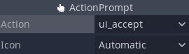

# Godot Input Prompts

This Godot plugin adds new nodes providing easy-to-use input prompts.

A demo of the prompts in action is available on [itch.io][1]; if you find this
plugin useful, please consider supporting my work there.

[1]:https://pennycook.itch.io/godot-input-prompts

The current version supports the following icons:
- Keyboard and mouse
- Xbox
- PlayStation
- Nintendo Switch

Please note that the PlayStation icons must be completed manually in an editor.

## ActionPrompt

ActionPrompt nodes display prompts based on the InputMap and an icon
preference. When set to "Automatic", the prompts update to match the input
device.

## JoypadButtonPrompt

JoypadButtonPrompt nodes display prompts corresponding to a button index.

## JoypadMotionPrompt

JoypadMotionPrompt nodes display prompts corresponding to an axis and an axis
value.

## KeyPrompt

KeyPrompt nodes display prompts corresponding to a key scancode.

## MousePrompt

MouseButtonPrompt nodes display prompts corresponding to a button index.

# License

Code is licensed under the MIT license.
Icons are in the [public domain][2], originally released by [Kenney][3].

[2]:https://creativecommons.org/publicdomain/zero/1.0/
[3]:https://kenney.nl/

